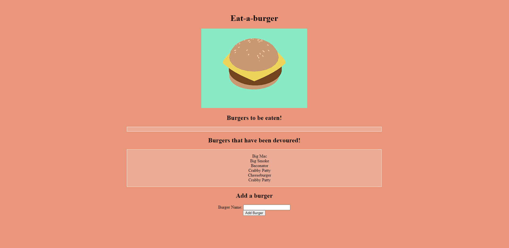

  # Eat-a-Burger

  

  ## Description 
  This is a full stack application, using handlebars for a dynamic front end, node, express and mysql in the backend, and deployed on Heroku. It allows the user to add burgers and eat them.
  
  Live application accessible here: https://arcane-gorge-29508.herokuapp.com/
  
  

  ## Table of Contents:
  * [Installation](#installation)
  * [Usage](#usage)
  * [License](#license)
  * [Contributing](#contributing)
  * [Tests](#tests)
  * [Questions](#questions)
  and so forth

  ## Installation:
  npm install

  ## Usage:
  run mysql -u root -p -> then enter your password for your local mysql database, then update the schema file with whatever you'd like and the seed the same way, run source schema/seed, update the password field in connection, and then run npm start/
  
  

  ## License:
  This project is licensed under MIT, click the badge to learn more.

  ## Contributing:
  [ckzard](https://www.github.com/ckzard)

  ## Tests:
  npm test

  ## Questions
  For any questions regarding this project please email me at:
  ckbzxz@gmail.com

